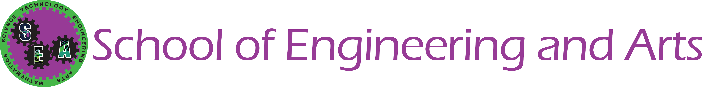

## Notes and Code for Code Club at School of Engineering and Arts Fall 2019

 

### Helpful Links

* [Trinket.io](https://trinket.io) - the online code editor we used in all of our projects
* [Code Club Projects](https://projects.raspberrypi.org/en/codeclub?utm_source=code-club-projects-site) - The official Code Club project site. All the projects we did plus more
* [Code Club Docs](https://drive.google.com/drive/folders/10xL0Nd-Lq8ghj1qSG4T40s97sVIBI_Tb) - the cheatsheets I shared with you along with other documents
* [HTML Colors](https://www.w3schools.com/colors/colors_names.asp) - an online color picker
* [Python Home](https://www.python.org/) - everything you need to get started with Python on any platform

### Beyond Code Club

*	[Python Coding Books](https://hclib.bibliocommons.com/v2/search?f_FORMAT=BK&f_TOPIC_HEADINGS=Python+%28Computer+program+language%29&query=python+programming&searchType=keyword) - Books available from the Hennepin County Library
*	[Coder Dojo](https://www.coderdojotc.org/) - Coder Dojo is a free resource that covers more than just coding.  There is also a girls only Dojo called [Rebecca Coder Dojo](https://codesavvy.org/rebecca-coderdojo/)
*	[The Bakken Museum](https://thebakken.org/) - Great STEM classes including coding with the BBC micro:bit
*	[Code Ninjas](https://www.codeninjas.com/locations/mn-edina/) -  not to be confused with Coder Dojo - Code Ninjas costs money, but has many great classes and school break options

### Weekly Updates

* [Week 1 - Welcome and Intro to Python](./weeks/week1.md)
