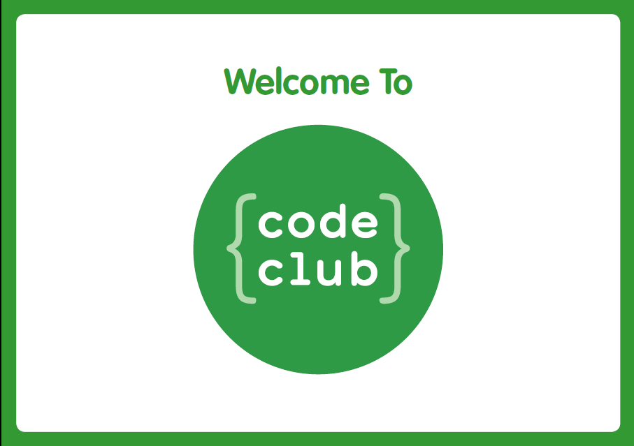

# Sea Code Club

## Notes and Code for Code Club at School of Engineering and Arts

### Helpful Links

* [Trinket.io](https://trinket.io)
* [Code Club Projects](https://projects.raspberrypi.org/en/codeclub?utm_source=code-club-projects-site)
* [Code Club Docs](https://drive.google.com/drive/folders/10xL0Nd-Lq8ghj1qSG4T40s97sVIBI_Tb)
* [W3Schools - HTML&CSS Resources](https://www.w3schools.com/)
* [HTML Colors](https://www.w3schools.com/colors/colors_names.asp)
* [Python Home](https://www.python.org/)

### Weekly Updates

* [Week 1 - Welcome and Intro to HTML](./weeks/week1.md)  
* [Week 2 - HTML & CSS](./weeks/week2.md)  
* [Week 3 - More fun with HTML & CSS](./weeks/week3.md)  
* [Week 4 - Intro to Python](./weeks/week4.md)

