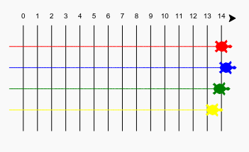

# Intro to Python #

This week we started looking at Python as a programming language.  Unlike HTML/CSS which are  markup languages (and for many people, not true programming), Python is a full powered and popular development language.

While there a lots of resources available for Python 2 (2.7), everything we will be doing will be Python 3.  There are some differences between them--enough that Python 2 code will not always run in a Python 3 environment without rewriting it (know as refactoring).

## Turtle Race ##

We worked together on this project:
[Turtle Race](https://projects.raspberrypi.org/en/projects/turtle-race) Using this [Trinket](http://jumpto.cc/python-new) 



```python
#!/bin/python3

from turtle import * #import everything from turtle
from random import randint #import only randint from random

speed(0) # the initial draw speed
penup() # raise the pen so it doesn't draw
goto(-140, 140) # move the pen to -140, 140

for step in range(15): # loop from 0 to 14
  write(step, align='center') #write the step number and center it on the line
  right(90) #turn right 90 degrees
  for num in range(8): #draw a dashed line
    penup()
    forward(10)
    pendown()
    forward(10)
  penup()
  backward(160) # go back to the top
  left(90)
  forward(20) # move over 20

red = Turtle() # create a new turtle called red
red.color('red') # change red's color
red.shape('turtle') # change red's shape

for turn in range(100):
  red.forward(randint(1,5)) # move red a random number forward